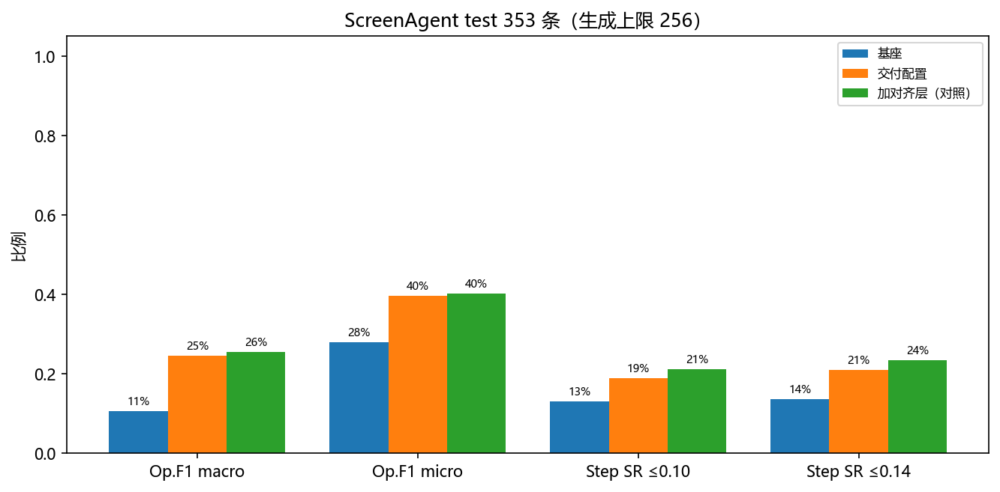
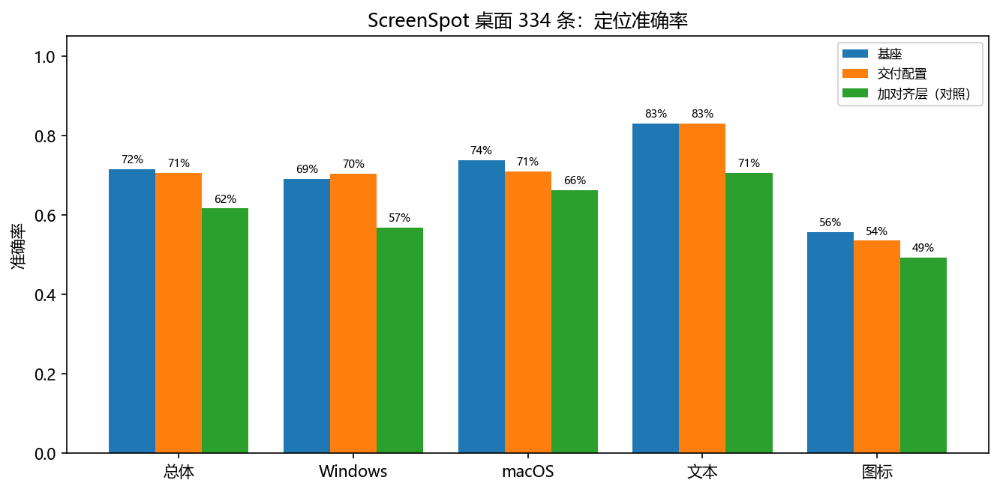

# 系统全面评估报告

2026-09-14 至 2026-09-20，对应大纲第 7 周。

孙山珉

---

## 一、评估对象

系统 v2.0：任务拆解与子任务反思、两段式定位（先问点什么，再问点哪）、执行后比对屏幕、单步失败
重试、每步日志。读字和找控件都由模型直接从截图完成。

| 配置 | 基座 | 微调权重 | 用途 |
|---|---|---|---|
| 微调 | Qwen2.5-VL-3B | `checkpoints/q25_proj`（语言模型 LoRA 2990 万 + 对齐层全量 3671 万） | 交付配置 |
| 基座 | Qwen2.5-VL-3B | 无 | 微调前后对比 |

推理在 RTX 4080 Laptop（12 GB）上以 bf16 进行。微调配方的取舍见《第 3 周实验报告》第七节。

---

## 二、测试集（第 7 周第 1 项）

### 离线

| 测试集 | 规模 | 测什么 |
|---|---|---|
| ScreenAgent 官方 test 划分 | 70 个任务、353 步，按任务描述归成 7 类应用 | 每一步给真实截图，看动作类型和点击位置对不对 |
| ScreenSpot 桌面部分 | 334 条：Windows 162、macOS 172；文本目标 194、图标目标 140 | 给控件描述，看定位点是否落在目标框内 |
| ScreenAgent 留出的拆解样本 | 20 条 | 拆出的子任务对参考拆解的覆盖率 |

三份都没有参与训练。

### 在线：25 个任务的评测集

`gui_agent/suite.py`。在原有 5 个基础任务、4 个复杂任务之外新写 16 个，按难度分三档：T1 单个
程序、1~3 步（8 个）；T2 单个程序、多步或要过对话框（9 个）；T3 跨程序或要完成多个子目标（8 个）。

验收参照 WebArena 的三类判定，只比对执行前后的状态，不看模型自己说没说完成：文件内容或窗口
标题里有没有指定文字（string_match）；本地网页点完停在哪一页（url_match，看页面标题，离线、
结果固定）；文件系统和进程状态（program）。任务文件只在 `logs/scratch/` 里读写；改系统设置、
发消息、命令行这几类没有收。

| 档 | 任务 | 程序 | 验收 |
|---|---|---|---|
| T1 | `open_browser` 打开浏览器 | 浏览器 | 出现新的浏览器进程和新窗口 |
| T1 | `search_content` 在浏览器里搜索 python | 浏览器 | 新窗口标题含 python |
| T1 | `open_file` 用记事本打开 sample.txt | 记事本 | 新窗口标题含 sample |
| T1 | `close_app` 关闭记事本 | 记事本 | 执行前开着的那个记事本进程已退出 |
| T1 | `open_explorer_folder` 打开资源管理器进入 scratch 文件夹 | 资源管理器 | 新窗口标题是该文件夹名 |
| T1 | `create_folder` 新建「新项目」文件夹 | 资源管理器 | 文件夹存在 |
| T1 | `open_calculator` 打开计算器 | 计算器 | 出现计算器窗口 |
| T1 | `maximize_window` 把 maximize_me 窗口最大化 | 记事本 | 执行前未最大化、执行后最大化 |
| T2 | `type_and_save` 输入「你好」保存为 output.txt | 记事本 | 文件内容含「你好」 |
| T2 | `append_line_in_place` 在 todo.txt 末尾加「买牛奶」并保存 | 记事本 | 原有一行和新行都在 |
| T2 | `rename_file` 把 report_v1.txt 重命名为 report_final.txt | 资源管理器 | 旧文件不在、新文件内容对 |
| T2 | `replace_all_text` 把「草稿」全部替换成「终稿」并保存 | 记事本 | 3 处全部替换 |
| T2 | `write_three_lines` 写三行水果名保存为 fruits.txt | 记事本 | 恰好三行且顺序对 |
| T2 | `save_blank_image` 用画图新建空白图片存为 blank.png | 画图 | 任务开始后写出、文件头是 PNG |
| T2 | `follow_local_link` 打开本地网页点「产品说明」 | 浏览器 | 页面标题变为产品说明页 |
| T2 | `delete_log_line` 删掉 app.log 里含 DEBUG 的那行 | 记事本 | DEBUG 行没了，另外两行还在 |
| T2 | `move_file_into_folder` 把 inbox/a.txt 移到「归档」 | 资源管理器 | 原位置没有、目标位置内容对 |
| T3 | `open_two_apps` 先开浏览器再开记事本 | 浏览器 + 记事本 | 两个程序都起来 |
| T3 | `append_and_save_as` 打开 sample.txt 加一行后另存为 reviewed.txt | 记事本 + 对话框 | 新文件含原内容和新行 |
| T3 | `copy_between_files` 把 source.txt 的文字复制到新文件 copy.txt | 记事本 × 2 | copy.txt 内容对 |
| T3 | `write_two_files` 新建 first.txt、second.txt 各写一句 | 记事本 × 2 | 两个文件内容都对 |
| T3 | `calculate_to_file` 用计算器算 128 × 256，结果写进 calc.txt | 计算器 + 记事本 | 文件含 32768 |
| T3 | `copy_order_number` 把网页上的订单号写进 order.txt | 浏览器 + 记事本 | 文件含订单号 |
| T3 | `submit_local_search` 在网页搜索框输入「显卡」并提交 | 浏览器 | 结果页标题含「显卡」 |
| T3 | `extract_meeting_time` 从 meeting.txt 找出开会时间写进 answer.txt | 记事本 × 2 | 文件含 14:30 |

---

## 三、定量评估（第 7 周第 2 项）

### 指标

指标沿用 GUI 智能体论文里常用的那套，不自造名字，这样和别人的结果能对上口径：

| 指标 | 定义 | 出处 |
|---|---|---|
| Op.F1 | 动作类型的 F1。macro 是各类型 F1 的平均（少数类和多数类同权），micro 等于类型准确率。键盘动作要输入内容也一致才算对 | Mind2Web 系列（SeeClick、OS-Atlas、Aguvis 都报这一项，对 TYPE 连内容一起比） |
| Step SR | 这一步整体算做对：类型对，坐标类动作的预测点与真值点的归一化距离还要在阈值内。报 ≤ 0.14 和更严的 ≤ 0.10 两档 | AITW 用「距离 ≤ 屏幕尺寸的 14%」判一步对不对 |
| 定位准确率 | 预测点落在目标控件框内的比例 | ScreenSpot |
| 无法执行率 | 模型没给出可执行动作的步数占比（输出解析不了、两段式定位不到） | 本项目自定，对应在线口径里的错误率 |
| 在线成功率 | 程序化验收通过的次数 / 运行次数，附 Wilson 95% 区间 | OSWorld、WindowsAgentArena 的任务成功率口径 |
| 在线执行时间 / 错误率 | 每次运行的墙钟时间；出错步数 / 总步数（解析失败、定位不到、执行异常） | 本项目自定 |

离线还给一个**离线任务成功率**：一个 session 里每一步都算做对，这条任务才算做对。离线评测每一步喂的是
真实截图、提示词不带历史，所以这是「每一步单独拿出来都做对」的严格口径，和在线连着做完不是一回事——
在线一步错了，后面的屏幕就全对不上。

### 离线结果

ScreenAgent test 353 步、70 个任务，生成上限 256，两段式。三个配置口径完全一致：动作类型要对，
键盘动作还要求输入内容也对，坐标类动作按归一化距离判定。

| 配置 | Op.F1 macro | Op.F1 micro | Step SR ≤0.10 | Step SR ≤0.14 | 无法执行 | 离线任务成功 | 每步耗时 |
|---|---|---|---|---|---|---|---|
| **微调，加对齐层全量训练（交付配置）** | **25.6%** | **40.2%** | **21.2%** | **23.5%** | 2.0% | 2/70 | 9.31 s |
| 微调，只训语言模型（对照） | 24.5% | 39.7% | 19.0% | 21.0% | 2.0% | 2/70 | 16.00 s |
| 基座，不微调 | 10.7% | 28.0% | 13.0% | 13.6% | 2.0% | 1/70 | 3.69 s |

每类动作的真值条数：click 181、hotkey 69、type 65、left_double 14、scroll 14、right_single 8、
wait 2。七类里有四类不足 15 条，macro 按类同权，这几类的 F1 抖动会直接反映到 macro 上，
所以读 macro 时一并看 micro。

**macro 和 micro 差得远，说明问题在哪。** 基座的 micro 有 28.0%，是被点击类拉起来的——353 步里
181 步真值是点击，而基座几乎只会点击；按类型同权的 macro 只有 10.7%，键盘动作、滚动、右键的 F1
都是 0。微调把 macro 提到 24.5%、micro 到 39.7%，Step SR 从 13.0% 到 19.0%。

提升集中在基座答不出的动作类型上：

| 动作 | 真值条数 | 基座 | 交付配置 | 只训语言模型（对照） |
|---|---:|---:|---:|---:|
| click | 181 | 0.509 | 0.661 | 0.665 |
| hotkey | 69 | 0.000 | 0.155 | 0.113 |
| type | 65 | 0.136 | 0.121 | 0.181 |
| scroll | 14 | 0.000 | 0.111 | 0.250 |
| left_double | 14 | 0.105 | 0.542 | 0.355 |
| right_single | 8 | 0.000 | 0.200 | 0.154 |
| wait | 2 | 0.000 | 0.000 | 0.000 |

非点击的 6 类合计 172 步，宏平均 F1 从基座的 4.0% 到交付配置的 18.8%。基座在 hotkey、scroll、
right_single 上的 F1 都是 0，微调后模型开始使用键盘、滚动和右键——扩展的是动作能力范围，
不只是把原本会的点击做得更准。`type` 这一类是唯一下降的（0.136 → 0.121）：它要求输入的文本
完全正确，65 步里两版都没学会，对照版 0.181 也谈不上会。

**为什么交付的是加训对齐层那一版。** 步级成功率把「类型对」和「点得准」混在一起，拆开之后
只取「真值是坐标类动作、且类型判断正确」的步，剩下的差异就只来自定位：

| 配置 | 这类步数 | 其中距离 ≤0.10 | 条件命中率 | 中位点击距离 |
|---|---:|---:|---:|---:|
| 基座 | 91 | 38 | 41.8% | 0.230 |
| 只训语言模型 | 118 | 45 | 38.1% | 0.192 |
| 加对齐层全量（交付） | 123 | 56 | **45.5%** | **0.127** |

交付配置是三组里点得最准的，也是唯一比基座更准的一组；只训语言模型那版的条件命中率反而低于基座。
选它的依据是这个流程内的度量，而不是 ScreenSpot——原因见下面的元素定位一节。

离线任务成功率最高只有 2/70：一个任务平均 5 步，要求每一步都对。每步耗时含两次模型调用
（先问操作哪个控件，再问它在哪）。

**任务拆解**（20 条留出的参考拆解）：子任务对参考拆解的覆盖率，基座 0.405、交付配置 0.489、
只训语言模型 0.474；中位数分别是 0.393、0.466、0.496。多余步数从基座的 +0.25 变成两版微调的
−0.10，即微调后拆得更贴近参考、不再多拆；三组都没有拆不出来的样本。

**元素定位**（ScreenSpot 桌面 334 条，Windows 162 / macOS 172，文本 194 / 图标 140）：

| 配置 | 总体 | 文本目标 | 图标目标 |
|---|---|---|---|
| 基座 | **239/334 = 71.6%** | **83.0%** | **55.7%** |
| 交付配置 | 236/334 = 70.7% | 83.0% | 53.6% |
| 加对齐层（对照） | 206/334 = 61.7% | 70.6% | 49.3% |

ScreenSpot 上交付配置比基座低 9.0 个百分点，但这个结论和流程内的定位度量相反（见上一节：
交付配置的条件命中率 45.5%，是三组最高）。两者分布不同：ScreenSpot 是单发元素定位、查询是
数据集给定的短控件名；本项目流程里第二问的查询是第一问自己产出的控件描述。所以这里把 ScreenSpot
当域外旁证看，判据用流程内的度量。

域外退化本身是真实信号，需要留意：25 个任务的真机套件是 Windows 桌面程序，也不是 ScreenAgent
的分布，交付配置的定位优势能否带过去要靠真机复测验证。

### 在线结果

在这台机器上跑，1280×720，两段式，动作真的落在桌面上。开跑前确认没有聊天软件（托盘里的也算）
和可见的浏览器窗口，存下桌面状态与进程表、最小化所有窗口；跑完恢复窗口、只关实验期间新开的
任务类程序，再核对分辨率、进程和窗口与实验前一致。日志由 `scripts/summarize_suite.py` 汇总。

时间所限，评测集每个任务跑 1 次（`--repeat 3` 的批次配置在 `scripts/vm/run_batches.py` 里，
留给后面在虚拟机里无人值守跑）。成功率附 Wilson 95% 区间，25 次的区间本来就宽，只用来比差距大的配置。

**25 个任务，两段式，1280×720，每个任务 1 次**

成功率与 Wilson 95% 区间未在本轮测得，原因见下面两条，补测后写在这里。

**一处口径问题必须先写清楚。** 训练集里 20 条 `finished` 样本是用这 25 个任务各自的终态程序化生成的
（官方数据里 `finished` 一条都没有，评测集 353 步里也是 0 条）。也就是说模型见过这些任务完成时的
屏幕，而端到端评测用的正是同一批任务——这对「知不知道自己做完了」这一项构成训练/测试污染。
要得到干净的端到端数字，需要另建一批与训练样本无关的任务，或者把 `finished` 样本换成与评测集无关的场景。

**另一处是这台机器的分辨率。** 训练与测试数据全部是 1024×768，评测按最接近的 16:9 模式跑 1280×720；
而本机原生 3840×2160、175% 缩放，切换分辨率会重排桌面图标，而套件里有任务需要双击桌面图标。
桌面图标状态会直接影响成功率，且与模型能力无关。稳妥的做法是放到带快照的虚拟机里跑
（批次配置已在 `scripts/vm/run_batches.py`）。

**已经从执行侧改掉的三处问题：**

1. **不知道自己做完了。** 官方数据里没有 `finished` 样本，模型没见过「做完了该收尾」的例子，
   任务会一直跑到步数上限。已补 20 条 `finished` 训练样本，但如上所述这批样本本身带污染，
   收益要在干净的任务集上才算得准。
2. **动作无效。** 执行后屏幕没有变化的步（点在空白处、快捷键在当前窗口无作用）会被变化检测识别并写进
   历史，连续 3 次重复同一动作判为卡住并终止，避免把步数耗在无效动作上。
3. **键名。** 模型会写 `Windows+E`、`Print_Screen`、`LShift` 这类同一个键的不同写法。
   `gui_agent/control.py` 里补齐了别名，并让认不出的键名直接报错——原来 pyautogui 会静默跳过，
   只按下组合键的一半。

**故障注入下重试的作用（基础 5 个任务，`--inject-failures 0.3`）。** 注入 30% 意味着每三步就有一步
模型输出被换成垃圾，用来看单步重试能不能把任务从「一次失败就终止」里救回来。跑法与统计口径在
`scripts/run_tasks.py`，结果与端到端成功率一起补测。

**复杂任务（开任务拆解，步数上限 15）。** 4 个任务需要跨对话框、跨程序，执行循环每步做一次反思，
反思判定当前子任务推不动时会重新拆解。结果同上待补测。

---

## 四、不同应用、不同分辨率（第 7 周第 3 项）

### 按应用

70 个任务按任务描述归成 7 类，格子里是「Op.F1 micro / Step SR ≤0.10」：

| 应用 | 步数 | 其中键盘动作 | 交付配置（加对齐层） | 只训语言模型（对照） | 基座 |
|---|---|---|---|---|---|
| 浏览器与网页 | 204 | 39% | 40% / 23% | 41% / 21% | 34% / 19% |
| 办公文档 | 63 | 30% | 48% / 24% | 43% / 22% | 19% / 6% |
| 系统工具 | 26 | 15% | 50% / 38% | 35% / 27% | 27% / 15% |
| 终端与代码 | 22 | 86% | 0% / 0% | 14% / 9% | 0% / 0% |
| 表格数据 | 21 | 57% | 33% / 10% | 24% / 5% | 0% / 0% |
| 游戏 | 10 | 0% | 70% / 0% | 100% / 0% | 100% / 0% |
| 图像编辑 | 7 | 14% | 43% / 29% | 29% / 0% | 14% / 0% |

差别主要跟着键盘动作的比例走。基座几乎只给点击，键盘动作占比高的两类它答不出来：终端与代码
（键盘占 86%）和表格数据（占 57%）的 Op.F1 micro 都是 0%。交付配置把表格数据拉到 33%、
办公文档从 19% 到 48%、系统工具从 27% 到 50%，这几类提升最大。浏览器与网页占 204 步，
决定了总体水平。

终端与代码是唯一的例外：交付配置仍是 0%，而只训语言模型的对照版有 14%。这一类 22 步里 86% 是
键盘动作、且要求输入的命令文本完全正确，两版都没学会，差异落在 22 步上不到 4 步，样本太少不宜
下结论。游戏 10 步、图像编辑 7 步同样只看方向：游戏那 10 步类型全对但点击全偏，找不同要点的
区域很小。

### 按分辨率

截图送进模型前按视觉 token 上限缩放，上限越低，模型看到的图越糊。ScreenSpot 桌面 334 条，
Qwen2.5-VL-3B 基座：

| 视觉 token 上限 | 总体 | 文本目标 | 图标目标 | 单条耗时 |
|---|---|---|---|---|
| 320 | 161/334 = 48.2% | 54.6% | 39.3% | 1.23 s |
| 640 | 221/334 = 66.2% | 73.7% | 55.7% | 1.53 s |
| 1280（执行时用的） | 239/334 = 71.6% | 83.0% | 55.7% | 1.68 s |
| 1920 | 241/334 = 72.2% | 83.0% | 57.1% | 1.90 s |

320 到 640 涨 18.0 个点，640 到 1280 涨 5.4 个点，1280 到 1920 只涨 0.6 个点（多对 2 条），
耗时从 1.68 s 升到 1.90 s。收益的拐点在 1280：文本目标到 1280 才到顶（73.7% → 83.0%），
图标目标从 640 到 1280 一条没多，要到 1920 才多对 2 条——图标小、没有文字可认，糊一点就找不着，
而这两档的差距还不够把它们认出来。

按视觉 token 预算选档位：跑 live 时用 1280（71.6%），显存或延迟吃紧降到 640（66.2%，掉 5.4 个点、
每条快 0.15 s），1920 只多对 2 条、每条慢 0.22 s，在噪声范围内（334 条上 1 个百分点约 3.3 条），
不值得。

---

## 五、与 UI-TARS、Claude Computer Use 的技术差距（第 7 周第 4 项）

### 三条路线

| | UI-TARS | Claude Computer Use | 本项目 |
|---|---|---|---|
| 形态 | 原生 GUI 智能体模型：截图进、键鼠动作出，感知、定位、推理都在一个模型里 | 通用大模型经 API 看截图、回键鼠动作，执行循环由调用方实现 | 3B 开源模型 + 外层框架：拆解、两段式定位、执行、变化检测、重试 |
| 模型 | 2B / 7B / 72B；1.5 版开源 7B | 未公开 | Qwen2.5-VL-3B，本机 12 GB 显卡推理 |
| 训练 | 大规模 GUI 感知数据、跨平台统一动作空间、System-2 推理（拆解、反思）、用带反思的在线轨迹迭代训练；UI-TARS-2 加数据飞轮和多轮强化学习 | 未公开 | 579 条监督样本（动作 395、拆解 184），LoRA 只训语言模型 |

### 公开结果

| 方案 | 发布 | 结果 | 出处 |
|---|---|---|---|
| Claude 3.5 Sonnet（computer use 首发） | 2024-10 | OSWorld 仅截图 14.9%，给更多步数 22.0% | Anthropic 公告 |
| UI-TARS-72B | 2025-01 | OSWorld 15 步 22.7、50 步 24.6；AndroidWorld 46.6 | arXiv 2501.12326 |
| UI-TARS-1.5 | 2025-04 | OSWorld 100 步 42.5（同表 Claude 3.7 为 28）；ScreenSpot-Pro 61.6；1.5-7B 的 OSWorld 27.5 | bytedance/UI-TARS |
| UI-TARS-2 | 2025-09 | OSWorld 47.5、WindowsAgentArena 50.6、AndroidWorld 73.3 | arXiv 2509.02544 |
| Claude Sonnet 4.5 | 2025-09 | OSWorld-Verified（最多 100 步、4 次平均）61.4% | Anthropic 公告 |
| Claude Opus 4.7 | 2026-05 | OSWorld-Verified 82.3%（调整跑法后更新的数） | Anthropic Opus 4.8 公告 |
| Claude Opus 4.8 | 2026-05 | Online-Mind2Web 84% | Anthropic 公告 |

本项目没有跑 OSWorld、AndroidWorld、Online-Mind2Web；定位用的是 ScreenSpot（v1）的桌面部分，
和 ScreenSpot-V2、ScreenSpot-Pro 不是同一份数据。所以上表只列出处，不和本项目的数放在一列比。

### 差距在哪

**连续做完任务。** 上表的 OSWorld、Online-Mind2Web 都是在线连续执行的成功率。本项目离线的「一个任务
每一步都做对」微调后是 2/70（基座 1/70），而离线每一步喂的都是真实截图，连着执行只会更难。

**训练数据和训练方式。** UI-TARS 的提升来自大规模 GUI 感知数据、统一动作空间和在线轨迹迭代，UI-TARS-2
又加了多轮强化学习。本项目是 579 条离线单步样本的监督微调，模型没有从自己的执行轨迹里学过。
提升的大头在「选对动作类型」（非点击的 6 类宏平均 F1 4.0% → 17.5%），点击精度也有提升
（条件命中率 41.8% → 45.5%）但幅度小得多，而且 1082 步官方数据里 428 步因为「图标没有文字、
写不出控件名」进不了训练。

**感知和定位。** UI-TARS 一次调用同时给出动作和坐标；本项目的点击要调用两次（先问操作哪个控件、
再问它在哪），离线每步 9.3 s。流程内的点击精度：坐标类动作里类型判断正确的 123 步中 56 步落在
真值 0.10 以内（45.5%），中位距离 0.127，基座是 41.8% 和 0.230。

**反思和纠错。** UI-TARS 把拆解和反思训进了模型；本项目在外层用提示词做拆解和反思，再加执行后比对
屏幕和单步重试。拆解与复杂任务的执行结果待本轮补测。

**评测规模。** OSWorld 在带快照的虚拟机里跑数百个任务，每个任务有专门写好的验收脚本；本项目是 25 个
任务、这一轮每个跑 1 次，区间宽，只适合比较差距较大的配置。

---

## 六、结论

1. 25 个任务的评测集（T1/T2/T3 = 8/9/8）和配套的验收、汇总、批量运行脚本已经就绪，验收只看执行前后的状态。
   在线结果要在虚拟机里跑。
2. 离线定量评估：交付配置（冻结 ViT、对齐层全量训练、语言模型 LoRA，两段式）在 ScreenAgent
   353 步上 Op.F1 macro 25.6%、micro 40.2%，Step SR ≤0.10 21.2%、≤0.14 23.5%，每步 9.3 s；
   按任务算，每一步都对的有 2/70。只训语言模型的对照版六项指标里五项更低，只有 ScreenSpot 更高，
   而 ScreenSpot 与流程内的定位度量给出相反结论，判据以后者为准。
3. 不同应用之间的差别主要来自键盘动作的比例：终端与代码、表格数据这类要打字的，基座几乎答不对，微调后提升
   最大；办公文档最好。分辨率上 1280 是拐点（71.6%），640 掉 5.4 个点，1920 只多对 2 条。
4. 和 UI-TARS、Claude 的差距主要在连续执行和训练方式上。它们用大规模 GUI 数据、在线轨迹和强化学习，公开的在线
   任务成功率在 OSWorld 上已经到 47.5（UI-TARS-2）和 61.4%（Claude Sonnet 4.5）；本项目是 579 条离线样本的
   监督微调，提升集中在动作类型，图标定位还有损失。
5. 接下来，按这一轮暴露出来的顺序：
   - **把端到端评测搬进虚拟机，并让「做完了」的训练样本与评测任务脱钩。** 现在这两件事互相污染，
     端到端数字测不干净，这是最先要解决的。
   - **补图标控件的训练样本。** 1082 步官方数据里 428 步（40%）因为「图标没有文字、写不出控件名」
     收不进两段式训练，定位因此没有提升。要用起来需要给图标生成描述并人工校验。
   - **点空了要换目标。** 变化检测已经把「上一步没反应」写进历史，模型没利用起来。可以在提示词里
     明确要求换目标，或把「点空 → 换目标」的轨迹做成训练样本。
   - 动作格式对齐基座原生的工具调用格式；用自己的执行轨迹做拒绝采样和偏好优化（DPO）。

---

## 附：实验清单

| 实验 | 样本 | 原始数据 |
|---|---|---|
| 动作生成，3 组配置（同口径） | ScreenAgent test 353 步 | `logs/screenagent_q25_lm_2s.json`、`logs/screenagent_q25_proj_2s.json`、`logs/screenagent_q25_base_2s.json`；汇总用 `scripts/score_actions.py` |
| 按应用拆分、离线任务成功率 | 同上 | `logs/screenagent_by_app.json`（`scripts/analyze_by_app.py`） |
| 元素定位 | ScreenSpot 桌面 334 条 | `logs/grounding_base.json`、`logs/grounding_q25_lm.json`、`logs/grounding_q25_proj.json` |
| 视觉 token 预算 | 同上，320 / 640 / 1280 / 1920 | `logs/grounding_base_320.json`、`_640`、`grounding_base.json`、`_1920` |
| 任务拆解 | 20 条留出参考拆解 | `logs/plan_base.json`、`logs/plan_q25_lm.json` |
| 25 个任务评测集（虚拟机） | 25 个任务 × 3 次 | `logs/tasks_vm_*_suite.json`，`scripts/summarize_suite.py` 汇总到 `logs/suite_summary.json` |
| 图表 | — | `docs/figures/`，`scripts/make_charts.py`、`scripts/analyze_by_app.py` |
