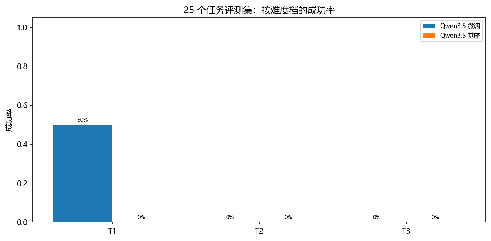
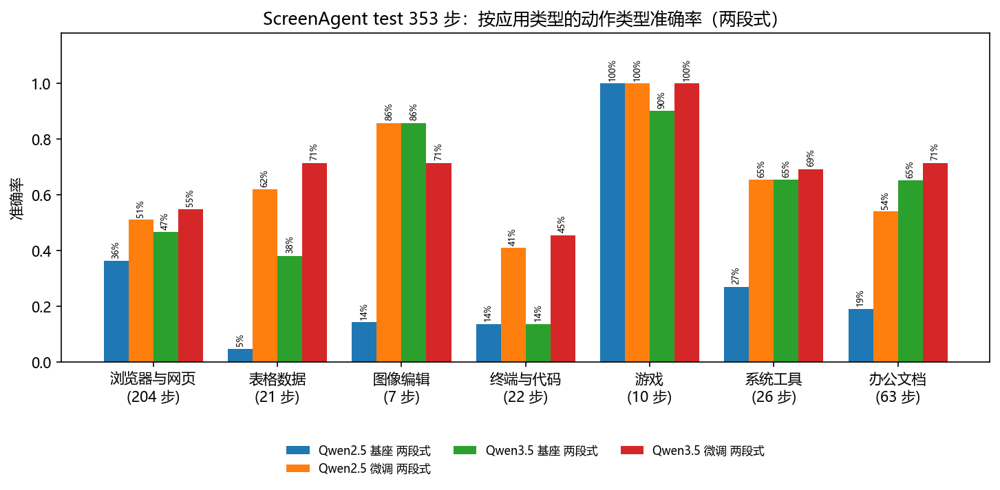
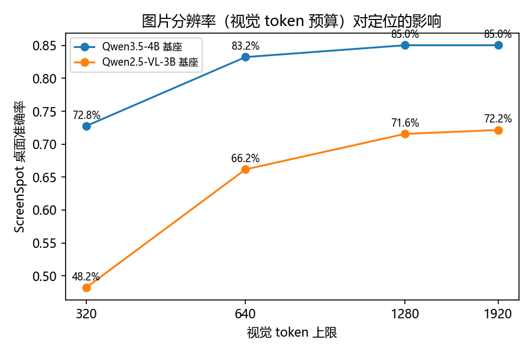

# 系统全面评估报告

2026-09-14 至 2026-09-20，对应大纲第 7 周。

孙山珉

---

## 一、评估对象

系统 v2.0：任务拆解与子任务反思、两段式定位（先问点什么，再问点哪）、执行后比对屏幕、单步失败
重试、每步日志。执行时不跑 OCR，读字和找控件都交给模型。

| 配置 | 基座 | 微调权重 | 用途 |
|---|---|---|---|
| Qwen3.5 微调 | Qwen3.5-4B | `checkpoints/q35_2sp`（LoRA，1440 万参数） | 交付配置 |
| Qwen3.5 基座 | Qwen3.5-4B | 无 | 微调前后对比 |
| Qwen2.5 微调 | Qwen2.5-VL-3B-Instruct | `checkpoints/lora_2sp`（LoRA，740 万参数） | 上一代对照 |

两个基座共用一套代码，切块大小、思考模式、定位坐标口径这几处差别在模型层处理，见
`docs/项目构建说明.md`。推理在 RTX 4080 Laptop（12 GB）上以 bf16 进行。

---

## 二、测试集（第 7 周第 1 项）

### 离线

| 测试集 | 规模 | 测什么 |
|---|---|---|
| ScreenAgent 官方 test 划分 | 70 个任务、353 步，按任务描述归成 7 类应用 | 每一步给真实截图，看动作类型和点击位置对不对 |
| ScreenSpot 桌面部分 | 334 条：Windows 162、macOS 172；文本目标 194、图标目标 140 | 给控件描述，看定位点是否落在目标框内 |
| ScreenAgent 留出的拆解样本 | 20 条 | 拆出的子任务对参考拆解的覆盖率 |

三份都没有参与训练。

### 在线：25 个任务的评测集

`gui_agent/suite.py`。在原有 5 个基础任务、4 个复杂任务之外新写 16 个，按难度分三档：T1 单个
程序、1~3 步（8 个）；T2 单个程序、多步或要过对话框（9 个）；T3 跨程序或要完成多个子目标（8 个）。

验收参照 WebArena 的三类判定，只比对执行前后的状态，不看模型自己说没说完成：文件内容或窗口
标题里有没有指定文字（string_match）；本地网页点完停在哪一页（url_match，看页面标题，离线、
结果固定）；文件系统和进程状态（program）。任务文件只在 `logs/scratch/` 里读写；改系统设置、
发消息、命令行这几类没有收。

| 档 | 任务 | 程序 | 验收 |
|---|---|---|---|
| T1 | `open_browser` 打开浏览器 | 浏览器 | 出现新的浏览器进程和新窗口 |
| T1 | `search_content` 在浏览器里搜索 python | 浏览器 | 新窗口标题含 python |
| T1 | `open_file` 用记事本打开 sample.txt | 记事本 | 新窗口标题含 sample |
| T1 | `close_app` 关闭记事本 | 记事本 | 执行前开着的那个记事本进程已退出 |
| T1 | `open_explorer_folder` 打开资源管理器进入 scratch 文件夹 | 资源管理器 | 新窗口标题是该文件夹名 |
| T1 | `create_folder` 新建「新项目」文件夹 | 资源管理器 | 文件夹存在 |
| T1 | `open_calculator` 打开计算器 | 计算器 | 出现计算器窗口 |
| T1 | `maximize_window` 把 maximize_me 窗口最大化 | 记事本 | 执行前未最大化、执行后最大化 |
| T2 | `type_and_save` 输入「你好」保存为 output.txt | 记事本 | 文件内容含「你好」 |
| T2 | `append_line_in_place` 在 todo.txt 末尾加「买牛奶」并保存 | 记事本 | 原有一行和新行都在 |
| T2 | `rename_file` 把 report_v1.txt 重命名为 report_final.txt | 资源管理器 | 旧文件不在、新文件内容对 |
| T2 | `replace_all_text` 把「草稿」全部替换成「终稿」并保存 | 记事本 | 3 处全部替换 |
| T2 | `write_three_lines` 写三行水果名保存为 fruits.txt | 记事本 | 恰好三行且顺序对 |
| T2 | `save_blank_image` 用画图新建空白图片存为 blank.png | 画图 | 任务开始后写出、文件头是 PNG |
| T2 | `follow_local_link` 打开本地网页点「产品说明」 | 浏览器 | 页面标题变为产品说明页 |
| T2 | `delete_log_line` 删掉 app.log 里含 DEBUG 的那行 | 记事本 | DEBUG 行没了，另外两行还在 |
| T2 | `move_file_into_folder` 把 inbox/a.txt 移到「归档」 | 资源管理器 | 原位置没有、目标位置内容对 |
| T3 | `open_two_apps` 先开浏览器再开记事本 | 浏览器 + 记事本 | 两个程序都起来 |
| T3 | `append_and_save_as` 打开 sample.txt 加一行后另存为 reviewed.txt | 记事本 + 对话框 | 新文件含原内容和新行 |
| T3 | `copy_between_files` 把 source.txt 的文字复制到新文件 copy.txt | 记事本 × 2 | copy.txt 内容对 |
| T3 | `write_two_files` 新建 first.txt、second.txt 各写一句 | 记事本 × 2 | 两个文件内容都对 |
| T3 | `calculate_to_file` 用计算器算 128 × 256，结果写进 calc.txt | 计算器 + 记事本 | 文件含 32768 |
| T3 | `copy_order_number` 把网页上的订单号写进 order.txt | 浏览器 + 记事本 | 文件含订单号 |
| T3 | `submit_local_search` 在网页搜索框输入「显卡」并提交 | 浏览器 | 结果页标题含「显卡」 |
| T3 | `extract_meeting_time` 从 meeting.txt 找出开会时间写进 answer.txt | 记事本 × 2 | 文件含 14:30 |

---

## 三、定量评估（第 7 周第 2 项）

### 指标

| | 在线（25 个任务） | 离线（ScreenAgent 353 步） |
|---|---|---|
| 成功率 | 验收通过的次数 / 运行次数，附 Wilson 95% 区间 | 离线任务成功率：一个任务的每一步都「类型对且点准」才算做对 |
| 平均执行时间 | 每次运行的墙钟时间 | 每步平均推理时间 |
| 错误率 | 出错的步数 / 总步数（解析失败、定位不到、执行异常） | 拿不出可执行动作的步数 / 总步数 |

「类型对且点准」指动作类型与真值一致，坐标类动作还要求预测点与真值点的归一化距离不超过 0.10。
离线评测每一步喂的是真实截图、提示词不带历史，离线任务成功率是「每一步单独拿出来都做对」的
严格口径，和在线连着做完不是一回事。

### 离线结果

ScreenAgent test 353 步、70 个任务，生成上限 256：

| 配置 | 动作类型准确 | 类型对且点准 | 无法执行 | 离线任务成功 | 每步耗时 |
|---|---|---|---|---|---|
| **Qwen3.5 微调，两段式（交付配置）** | **60.9%** | **37.7%** | 1.7% | **7/70** | 8.10 s |
| Qwen3.5 基座，两段式 | 50.7% | 24.9% | 1.1% | 4/70 | 7.58 s |
| Qwen3.5 基座，一段式（带 OCR 清单） | 45.9% | 17.3% | 10.2% | 3/70 | 7.60 s |
| Qwen2.5 微调，两段式 | 54.7% | 32.0% | 4.0% | 5/70 | 6.87 s |
| Qwen2.5 基座，两段式 | 30.6% | 15.6% | 2.0% | 1/70 | 3.58 s |
| Qwen2.5 基座，一段式（带 OCR 清单） | 42.2% | 18.1% | 3.4% | 0/70 | 4.95 s |

交付配置的动作类型准确率、类型对且点准和离线任务成功率都是最高的：比 Qwen3.5 基座高 10.2 和 12.7 个点，
比同配方的 Qwen2.5 高 6.2 和 5.7 个点，拿不出可执行动作的步不到 2%。离线任务成功率最高也只有 7/70：
一个任务平均 5 步，要求每一步都对。每步耗时包含两次模型调用（先问点什么，再问点哪）。

### 在线结果

在这台机器上跑，1280×720，两段式，动作真的落在桌面上。开跑前确认没有聊天软件（托盘里的也算）
和可见的浏览器窗口，存下桌面状态与进程表、最小化所有窗口；跑完恢复窗口、只关实验期间新开的
任务类程序，再核对分辨率、进程和窗口与实验前一致。日志由 `scripts/summarize_suite.py` 汇总。

时间所限，评测集每个任务跑 1 次（`--repeat 3` 的批次配置在 `scripts/vm/run_batches.py` 里，
留给后面在虚拟机里无人值守跑）。成功率附 Wilson 95% 区间，25 次的区间本来就宽，只用来比差距大的配置。

**25 个任务，两段式，1280×720，每个任务 1 次**

| 配置 | 成功率（Wilson 95%） | T1 | T2 | T3 | 平均耗时 | 平均步数 | 错误率 |
|---|---|---|---|---|---|---|---|
| Qwen3.5 + `q35_2sp`（交付） | 4/25 = 16%（6%~35%） | 4/8 | 0/9 | 0/8 | 147.2 s | 11.0 | 6.6%（18/274 步） |
| Qwen3.5 基座 | 0/25 = 0%（0%~13%） | 0/8 | 0/9 | 0/8 | 132.7 s | 10.0 | 6.4%（16/250 步） |

通过的四个都是 T1：打开浏览器、在浏览器里搜索、关闭记事本、打开资源管理器进入指定文件夹——
一两步就能完成、验收只看窗口或进程。两组的区间有重叠（4/25 对 0/25），只能说方向和离线一致，
25 次分不出更细的差别。

**微调前后最明显的差别是「动作有没有效果」。** 基座那 250 步里，执行后屏幕发生变化的是 0 步：
它几乎只点击（229 步点击、16 步 call_user、3 步快捷键、2 步打字），点的位置又多半是空白处。
微调后的 274 步里有 66 步让屏幕变了，动作分布也不一样：点击 93、快捷键 85、打字 33、等待 40。
离线评测里「键盘动作召回 2.3% → 51.9%」，在真机上的表现就是这个：会用 Ctrl+S、会往框里打字，
任务才推得动。

**失败集中在三处**（逐条轨迹在 `logs/tasks_live_q35_2sp_suite.json`）：

1. **不知道自己做完了。** 25 个任务里只有 1 个主动给出 `finished`（`maximize_window`，两步就说完成，
   验收不通过），其余 24 个都跑到步数上限。这件事离线评测量不出来：ScreenAgent test 的 353 步里
   `finished` 一条都没有，交付配方的 375 条动作训练样本里也是 0 条——
   模型没见过「做完了该收尾」的例子。
2. **动作打空。** 274 步里 208 步（76%）执行后屏幕没有变化：点到了没有控件的位置，或者快捷键在
   当前窗口没有作用。变化检测能看出来并写进历史，但模型下一步多半还是原样再来一次——连续 3 次
   重复同一动作被判卡住的有 5 步。
3. **键名。** 18 个出错的步里 10 步是键名不认识：模型写 `Windows+E`、`Print_Screen`、`LShift`，
   都是同一个键的别的写法。这一轮跑完之后在 `gui_agent/control.py` 里补齐了别名，并让认不出的键名直接报错（原来 pyautogui 会静默跳过、只按下组合键的一半），没有重跑这一轮。

**30% 故障注入下重试的作用（基础 5 个任务，`--inject-failures 0.3`）**

| 重试上限 | 验收通过 | 被故障终止 | 平均步数 | 出错步 |
|---|---|---|---|---|
| 0 | 0/5 | 5/5 | 6.2 | 5/31 |
| 2 | 0/5 | 1/5 | 11.0 | 15/55 |

注入 30% 意味着每三步就有一步模型输出被换成垃圾。关掉重试，5 个任务全部在第一次注入上终止，
平均 6.2 步；开重试（额度 2），只有 1 个任务连着撞上三次注入而终止，其余跑满 12 步。两组都没有
通过验收——注入本身破坏了三成动作，这一组只用来看重试有没有把任务从「直接终止」里救回来。

**4 个复杂任务（开任务拆解，步数上限 15）**：0/4 通过。拆解本身没问题——「打开记事本 → 另存为 →
保存到指定路径 → 输入文字」这种顺序都对，平均拆成 5.5 个子任务；问题在执行：每步执行后的反思里
`need_reformulate`（当前子任务推不动、要重新拆）占了 42 次里的 39 次，两个任务跑满 15 步，另两个
在连续判定没推进后停下。和第 3 周在 Qwen2.5 上的结论一样：拆得对，执行跟不上。

**这一轮 live 的总结。** 25 个任务的评测集把差别测出来了：微调把「只会点、点了没反应」变成「会用
快捷键和打字」，T1 从 0/8 到 4/8；但 T2 要过另存为对话框、T3 要跨程序，12 步的预算加上不会判断
自己做完了，两档都是 0。要往上走，先解决「知道做完了」和「点空了就换个目标」这两件事，
而不是继续调提示词。

---

## 四、不同应用、不同分辨率（第 7 周第 3 项）

### 按应用

70 个任务按任务描述归成 7 类，格子里是「动作类型准确率 / 类型对且点准」：

| 应用 | 步数 | 其中键盘动作 | Qwen3.5 微调 两段式 | Qwen3.5 基座 两段式 | Qwen2.5 微调 两段式 |
|---|---|---|---|---|---|
| 浏览器与网页 | 204 | 39% | 55% / 35% | 47% / 22% | 51% / 31% |
| 办公文档 | 63 | 30% | 71% / 51% | 65% / 40% | 54% / 32% |
| 系统工具 | 26 | 15% | 69% / 42% | 65% / 50% | 65% / 42% |
| 终端与代码 | 22 | 86% | 45% / 36% | 14% / 5% | 41% / 41% |
| 表格数据 | 21 | 57% | 71% / 38% | 38% / 10% | 62% / 33% |
| 游戏 | 10 | 0% | 100% / 0% | 90% / 0% | 100% / 0% |
| 图像编辑 | 7 | 14% | 71% / 43% | 86% / 29% | 86% / 43% |

差别主要跟着键盘动作的比例走。基座在两段式下几乎只给点击：键盘动作占 86% 的终端与代码，动作类型准确率只有
14%；占 57% 的表格数据是 38%。微调后分别到 45% 和 71%。键盘动作少的办公文档、系统工具，基座本来就不差，
微调后办公文档是最好的一类（类型对且点准 51%）。浏览器与网页占 204 步，决定了总体水平。游戏只有 1 个任务
10 步、图像编辑 7 步，只看方向；游戏那 10 步类型都对、点击全偏，找不同要点的区域很小。

### 按分辨率

截图送进模型前按视觉 token 上限缩放，上限越低，模型看到的图越糊。ScreenSpot 桌面 334 条，
Qwen3.5-4B 基座：

| 视觉 token 上限 | 总体 | 文本目标 | 图标目标 | 单条耗时 |
|---|---|---|---|---|
| 320 | 243/334 = 72.8% | 80.9% | 61.4% | 2.86 s |
| 640 | 278/334 = 83.2% | 89.2% | 75.0% | 3.02 s |
| 1280（执行时用的） | 284/334 = 85.0% | 89.7% | 78.6% | 3.21 s |
| 1920 | 284/334 = 85.0% | 89.2% | 79.3% | 4.50 s |

320 到 640 涨 10.5 个点，640 到 1280 涨 1.8 个点，1280 到 1920 总数一条没变（文本少对 1 条、
图标多对 1 条），耗时却从 3.21 s 升到 4.50 s。图标目标对分辨率最敏感（61.4% → 78.6%），文本目标
在 640 就基本到顶——图标小、没有文字可认，糊一点就找不着。所以执行时用 1280；显存紧张时降到 640
只掉 1.8 个点，是划算的退路，再往上加预算只会变慢。

同一口径下的 Qwen2.5-VL-3B 基座：

| 视觉 token 上限 | 总体 | 文本目标 | 图标目标 | 单条耗时 |
|---|---|---|---|---|
| 320 | 161/334 = 48.2% | 54.6% | 39.3% | 1.23 s |
| 640 | 221/334 = 66.2% | 73.7% | 55.7% | 1.53 s |
| 1280 | 239/334 = 71.6% | 83.0% | 55.7% | 1.68 s |
| 1920 | 241/334 = 72.2% | 83.0% | 57.1% | 1.90 s |

两代对分辨率的敏感度不一样：Qwen2.5 从 320 到 640 涨 18.0 个点、到 1280 再涨 5.4 个点，到 1920 还能涨
0.6 个点，一直没吃饱；Qwen3.5 在 640 就基本到位。更直接的说法是，**Qwen3.5 在 320 个视觉 token 下的
72.8% 和 Qwen2.5 在 1920 下的 72.2% 持平**——同样的定位水平，新基座少看六倍的图块，每条还快不了多少
（2.86 s 对 1.90 s，Qwen3.5 的回答更长）。

---

## 五、与 UI-TARS、Claude Computer Use 的技术差距（第 7 周第 4 项）

### 三条路线

| | UI-TARS | Claude Computer Use | 本项目 |
|---|---|---|---|
| 形态 | 原生 GUI 智能体模型：截图进、键鼠动作出，感知、定位、推理都在一个模型里 | 通用大模型经 API 看截图、回键鼠动作，执行循环由调用方实现 | 4B 开源模型 + 外层框架：拆解、两段式定位、执行、变化检测、重试 |
| 模型 | 2B / 7B / 72B；1.5 版开源 7B | 未公开 | Qwen3.5-4B，本机 12 GB 显卡推理 |
| 训练 | 大规模 GUI 感知数据、跨平台统一动作空间、System-2 推理（拆解、反思）、用带反思的在线轨迹迭代训练；UI-TARS-2 加数据飞轮和多轮强化学习 | 未公开 | 559 条监督样本（动作 375、拆解 184），LoRA 只训语言模型 |

### 公开结果

| 方案 | 发布 | 结果 | 出处 |
|---|---|---|---|
| Claude 3.5 Sonnet（computer use 首发） | 2024-10 | OSWorld 仅截图 14.9%，给更多步数 22.0% | Anthropic 公告 |
| UI-TARS-72B | 2025-01 | OSWorld 15 步 22.7、50 步 24.6；AndroidWorld 46.6 | arXiv 2501.12326 |
| UI-TARS-1.5 | 2025-04 | OSWorld 100 步 42.5（同表 Claude 3.7 为 28）；ScreenSpot-Pro 61.6；1.5-7B 的 OSWorld 27.5 | bytedance/UI-TARS |
| UI-TARS-2 | 2025-09 | OSWorld 47.5、WindowsAgentArena 50.6、AndroidWorld 73.3 | arXiv 2509.02544 |
| Claude Sonnet 4.5 | 2025-09 | OSWorld-Verified（最多 100 步、4 次平均）61.4% | Anthropic 公告 |
| Claude Opus 4.7 | 2026-05 | OSWorld-Verified 82.3%（调整跑法后更新的数） | Anthropic Opus 4.8 公告 |
| Claude Opus 4.8 | 2026-05 | Online-Mind2Web 84% | Anthropic 公告 |
| Qwen3.5-4B（本项目的基座） | 2026-02 | ScreenSpot-Pro 60.3、OSWorld-Verified 35.6、AndroidWorld 58.6，卡上没写所用框架和步数 | Hugging Face 模型卡 |

本项目没有跑 OSWorld、AndroidWorld、Online-Mind2Web；定位用的是 ScreenSpot（v1）的桌面部分，
和 ScreenSpot-V2、ScreenSpot-Pro 不是同一份数据。所以上表只列出处，不和本项目的数放在一列比。

### 差距在哪

**连续做完任务。** 上表的 OSWorld、Online-Mind2Web 都是在线连续执行的成功率。本项目离线的「一个任务
每一步都做对」，Qwen3.5 微调后是 7/70（基座 4/70），离线每一步喂的都是真实截图，连着执行只会更难。
同一个基座在 Qwen 官方的评测里 OSWorld-Verified 是 35.6，卡上没写所用的智能体框架和动作格式；本项目
用的是自定的中文 JSON 提示词和两段式调用，没有用模型原生的工具调用格式，这是最先要对齐的一处。

**训练数据和训练方式。** UI-TARS 的提升来自大规模 GUI 感知数据、统一动作空间和在线轨迹迭代，UI-TARS-2
又加了多轮强化学习。本项目是 559 条离线单步样本的监督微调，模型没有从自己的执行轨迹里学过。结果也
对应得上：微调提升的几乎都是「选对动作类型」（键盘动作召回 2.3% → 51.9%），点击精度没变
（距离 ≤ 0.10 为 48.8% 和 47.9%），图标定位还掉了 5 个点，因为训练样本的控件名都来自 OCR 文字。

**感知和定位。** UI-TARS 一次调用同时给出动作和坐标；本项目的点击要调用两次（先问点什么、再问点哪），
离线每步 8.1 s。定位这一问直接用基座的能力，ScreenSpot 桌面 85.0%，文本目标 89.7%、图标目标 78.6%。

**反思和纠错。** UI-TARS 把拆解和反思训进了模型；本项目在外层用提示词做拆解和反思，再加执行后比对屏幕
和单步重试。第 3 周在 Qwen2.5 上的结果是拆解能拆对，执行跟不上（复杂任务拆解 4 条全对，成功 0/4）。

**评测规模。** OSWorld 在带快照的虚拟机里跑数百个任务，每个任务有专门写好的验收脚本；本项目是 25 个
任务、这一轮每个跑 1 次，区间宽，只适合比较差距较大的配置。

---

## 六、结论

1. 25 个任务的评测集（T1/T2/T3 = 8/9/8）和配套的验收、汇总、批量运行脚本已经就绪，验收只看执行前后的状态。
   在线结果要在虚拟机里跑。
2. 离线定量评估：交付配置（Qwen3.5-4B + `q35_2sp`，两段式）在 ScreenAgent 353 步上动作类型准确率 60.9%、
   类型对且点准 37.7%，每步 8.1 s，拿不出可执行动作的步 1.7%；按任务算，每一步都对的有 7/70。
3. 不同应用之间的差别主要来自键盘动作的比例：终端与代码、表格数据这类要打字的，基座几乎答不对，微调后提升
   最大；办公文档最好。分辨率上，Qwen3.5 在 640 个视觉 token 就基本到位（83.2%，1280 是 85.0%，1920 不再涨），
   Qwen2.5 一直到 1920 还在涨；Qwen3.5 在 320 下的定位就追平 Qwen2.5 在 1920 下的水平。
4. 和 UI-TARS、Claude 的差距主要在连续执行和训练方式上。它们用大规模 GUI 数据、在线轨迹和强化学习，公开的在线
   任务成功率在 OSWorld 上已经到 47.5（UI-TARS-2）和 61.4%（Claude Sonnet 4.5）；本项目是 559 条离线样本的
   监督微调，提升集中在动作类型，点击精度没有提升，图标定位还有损失。
5. 接下来，按这一轮暴露出来的顺序：
   - **训练数据里加「做完了」的样本。** 现在 375 条动作样本里 `finished` 一条都没有，评测集里也没有，
     模型自然不会收尾——25 个任务里 24 个跑到步数上限。这是投入最小、最直接对着成功率的一件事。
   - **点空了要换目标。** 274 步里 208 步执行后屏幕没变化，而变化检测已经把这件事写进历史了，
     模型没利用起来。可以在提示词里明确写「上一步没有反应，换一个目标或换一种方式」，或者把
     「点空 → 换目标」的轨迹做成训练样本。
   - 动作格式对齐基座原生的工具调用格式；补图标控件的训练样本（现在控件名都来自 OCR 文字）；
     用自己的执行轨迹做拒绝采样和偏好优化（DPO）。

---

## 附：实验清单

| 实验 | 样本 | 原始数据 |
|---|---|---|
| 动作生成，6 组配置 | ScreenAgent test 353 步 | `logs/screenagent_q35_2sp_2s.json`、`logs/screenagent_q35_base_2s.json`、`logs/screenagent_q35_base_cases.json`、`logs/screenagent_lora2sp_2s_fix.json`、`logs/screenagent_base_2s_256.json`、`logs/screenagent_base_cases.json` |
| 按应用拆分、离线任务成功率 | 同上 | `logs/screenagent_by_app.json`（`scripts/analyze_by_app.py`） |
| 元素定位 | ScreenSpot 桌面 334 条 | `logs/grounding_q35_base.json`、`logs/grounding_q35_2sp.json`、`logs/grounding_base.json`、`logs/grounding_lora2sp.json` |
| 视觉 token 预算 | 同上，320 / 640 / 1280 / 1920 | `logs/grounding_q35_base_320.json` 等、`logs/grounding_base_320.json` 等 |
| 任务拆解 | 20 条留出参考拆解 | `logs/plan_q35_base.json`、`logs/plan_q35_2sp.json` |
| 25 个任务评测集（虚拟机） | 25 个任务 × 3 次 | `logs/tasks_vm_*_suite.json`，`scripts/summarize_suite.py` 汇总到 `logs/suite_summary.json` |
| 图表 | — | `docs/figures/`，`scripts/make_charts.py`、`scripts/analyze_by_app.py` |
